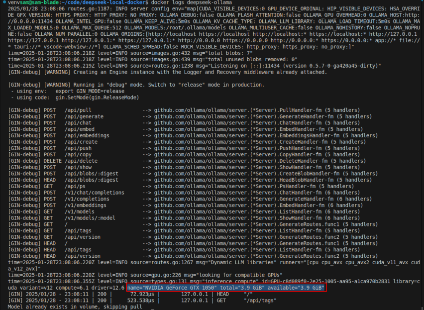

# Appendix

Extra information that doesn't fit in the main documentation.

## Make Commands

The project includes several make commands to simplify common operations. These commands handle everything from setup to monitoring GPU usage.

### Setup Commands
- `make install-docker` - Installs Docker and all required dependencies
- `make setup-gpu` - Installs NVIDIA drivers and GPU dependencies
- `make test-gpu` - Runs a test container to verify GPU availability and driver installation

### Start Commands
- `make docker-up-linux-gpu` - Starts containers with GPU support on Linux.

  *Equivalent to:* `docker compose -f docker-compose.yml -f docker-compose.gpu.yml up -d`

- `make docker-up-mac-gpu` - Starts containers with GPU support on macOS.

  *Equivalent to:* `docker compose -f docker-compose.yml -f docker-compose.mac.yml up -d`

- `make docker-up-windows-gpu` - Starts containers with GPU support on Windows.

  *Equivalent to:* `docker compose -f docker-compose.yml -f docker-compose.gpu.yml -f docker-compose.windows.yml up -d`

- `make docker-up-cpu-only` - Starts containers without GPU support (CPU only mode).

  *Equivalent to:* `docker compose up -d`

### Utility Commands
- `make watch-gpu` - Shows real-time GPU usage statistics (updates every 0.5 seconds)
- `make clean-up` - Stops and removes all running containers

## FAQ

### How do I see if the service is running?

Run `docker ps` on your host machine. You should see something like this:

### How do I check if the model is downloaded?

Run `docker logs -f deepseek-ollama` to see the progress of the model download.

### How do I determine if my GPU is being used?

#### Method 1

Run `make watch-gpu` on your host machine. Submit a prompt using the web ui or cli. You should see the processes as below:

If you see something like this, your GPU is being used:

#### Method 2

Run `docker logs deepseek-ollama` on your host machine. You should see:

