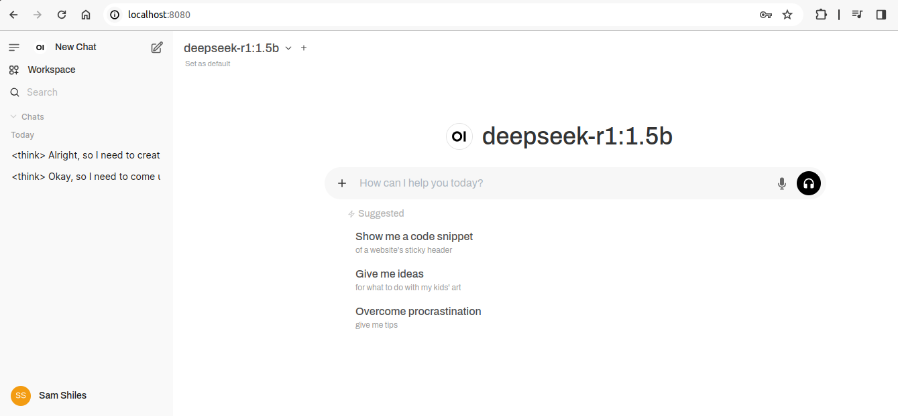
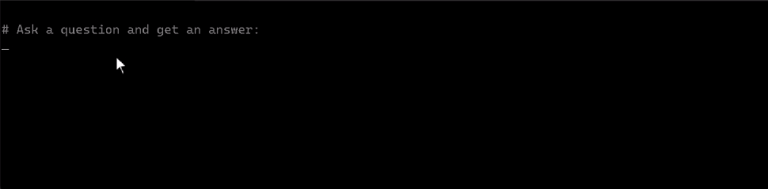
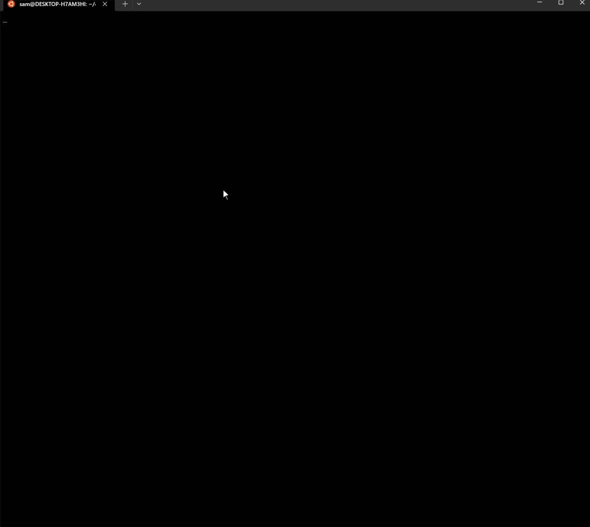
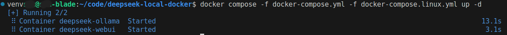
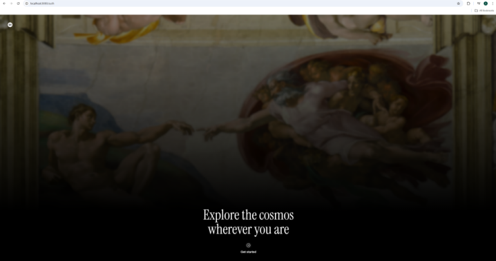
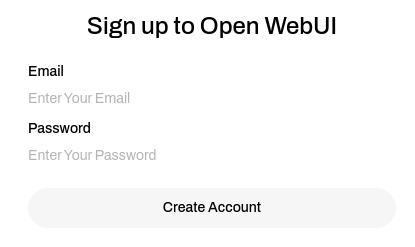
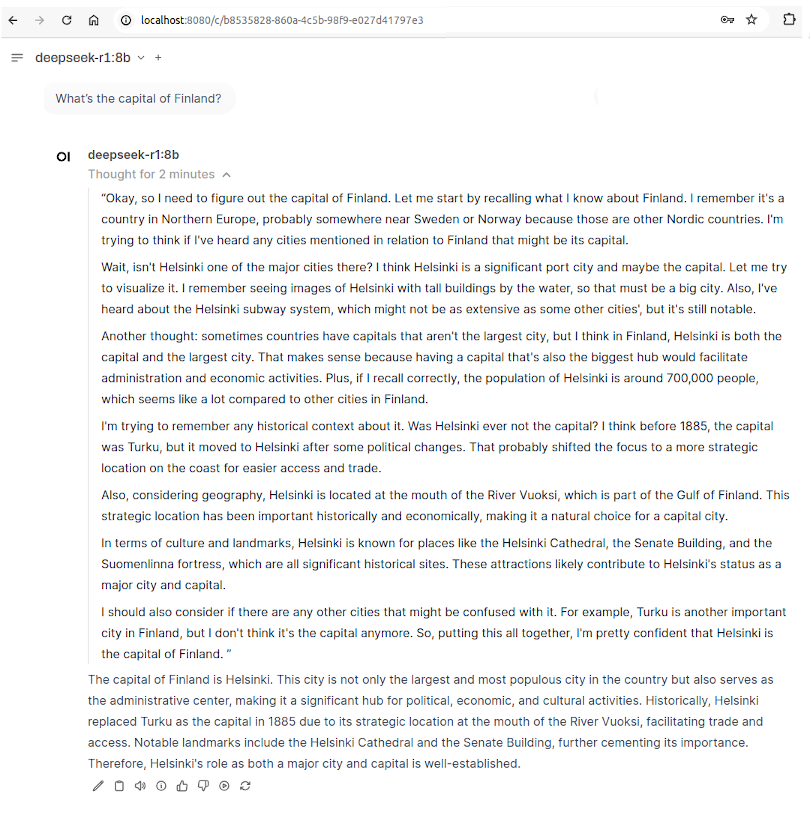
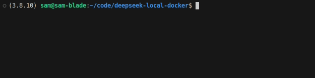
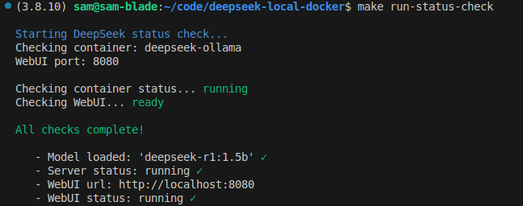

```bash
                                    ./////////     //,    .*
                            //////////////,  ////////
                            /*. */////////////..//
                            /*       *////*  /////
                            //*        ./////////
                            *//,   ,*   */////.
                              ./////////*../////


       .//                                                                        //,
  ,**/ .//   .*////,     ,/////,   //,*////.    .//////.    ./////,     ,/////.   //,    ///
*/*    .//  //.    //, .//     //  ///     //  ,//    .,.  //.    */, .//     //. //,  ///
//     .//  /* .****** */. ,*****. //,     */    ***////, ./* .*****, ,/, ,****** //, *//
,//,..*///  *//,.,*//   ///,.,///  //, ,**//,  ///.  .///  *//,.,*//   ///,.,*//  //,   ///
    .   ..      .           .      //,             ..          ..          .      ..      ..
                                   //,

                          _____    ___
                          |  _  \  |_  |
                          | |_| |    | |
                          |  _  /    | |
                          | | \ \    | |     |  |¯| |¯ /¯\ |
                          |_|  \_\   |_|     |_ |_| |_ |¯| |_

```

# DeepSeek R1 Local

Run DeepSeek R1 models locally using Docker. Interact with the model through a browser-based UI or CLI using Ollama.

If you're concerned about the privacy considerations of using a cloud-based model, this is the solution for you.

## Model Interaction Methods

### Web UI
Access the interface at `http://localhost:8080`



### CLI
```bash
# docker exec
docker exec -it deepseek-ollama ollama run deepseek-r1:1.5b "What is the capital of France?"

# or, utility script
./scripts/interact.sh
```



### CLI Interactive Terminal
```bash
# docker exec
docker exec -it deepseek-ollama ollama run deepseek-r1:1.5b

# or, utility script
./scripts/prompt.sh "What's the capital of France?"
```


## Additional Information

- [Linux Setup and GPU Support](docs/linux.md)
- [Windows Setup and GPU Support](docs/windows.md)
- [Mac Setup and GPU Support](docs/mac.md)
- [Environment Variables](docs/envvars.md)
- [Privacy and the CCP](docs/privacy.md)
- [Appendix/FAQ](docs/appendix.md)

## Demo

The demo process video is actually a scripted interaction with a real terminal and is include in this repo. So... you could just run that to to replicate what you see in the video.

```bash
./run-demo.sh
```

Alternatively... read on.

## Quick Start

### With Pictures



### In Words

1. Install Docker and Docker Compose (see your OS-specific guide)

2. Run `docker compose up -d`
You should see something like this:



3. Access the Web UI at `http://localhost:8080`



4. Create an account.



5. Submit a prompt!



### Initial Startup

When first starting the container, the model will be downloaded. This may take a few minutes. The default model of 1.5B parameters is 1.1gb. File size for other models can be found in the [Available Models](#available-models) section.

To check the progress start up you can run `make run-status-check`

**Download in progress:**




**Status check OK:**



## Available Models

By default, the 1.5B parameter model is used. Larger models offer improved quality but require more resources.

To change the model size:

1. Stop the containers:
```bash
docker compose down
```

2. Set the MODEL_SIZE environment variable:
```bash
export MODEL_SIZE=8b
```

3. Rebuild and start:
```bash
docker compose up -d --build
```

Note: If you enable gpu support previously, you will need to reuse those commands and pass the `--build` flag.
e.g.
```bash
docker compose -f docker-compose.yml -f docker-compose.gpu.yml up -d --build
```

Alternatively, modify MODEL_SIZE directly in docker-compose.yml:
```yaml
environment:
  - MODEL_SIZE=8b
```

## Suggested Hardware Requirements

In reality, you might get away with less. Alternatively, if your expecting instant responses, you may need more. So use this as a rough guide.

| Parameters | RAM | GPU | Storage | CPU | Model Size |
|------------|-----|-----|---------|-----|------------|
| 1.5B | 8GB | RTX 3060 (4GB) | 16GB NVMe | 6+ core | 1.1GB |
| 7B | 16GB | RTX 4070 Ti (8GB) | 32GB NVMe | 8+ core | 4.7GB |
| 8B | 20GB | RTX 4080 (8GB) | 40GB NVMe | 8+ core | 4.9GB |
| 14B | 32GB | RTX 4090 (16GB) | 64GB NVMe | 12+ core | 9GB |
| 32B | 64GB | 2x RTX 4090/A6000 | 128GB NVMe | 16+ core | 20GB |
| 70B | 160GB | 2x A100 (80GB) | 256GB NVMe | 32+ core | 43GB |
| 671B | 1.5TB+ | 8+ H100s | 2-3TB NVMe | 64+ core | 404GB |
